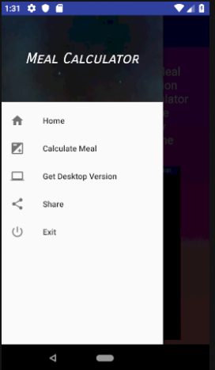
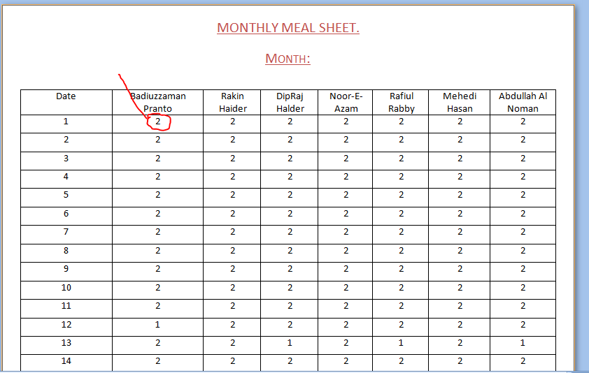
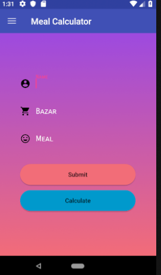
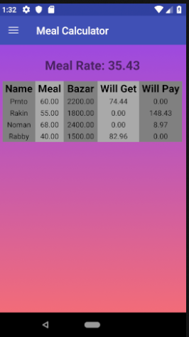

# mealcalculator  
##### An android app which can calculate the monthly meal rate

## Why this is useful:
 In real life, those who lives in a hoslte or sharing flat/appertment with friends, they need to share the cost of meals/food also.
 At the end of every month, we need to do this calculations manually. It is time consuming. So, this app comes with some features 
 that helps us to calculate monthly meal costs of each persons easily.

## Features:
 * We can calculate monthly meals
 * This app will show results (Name, Bazar, Total meal of that person, how much money he/she will get, how much money he/she will pay) in a tabular format.
 
## How to Use?
  * You have to maintain a paper/sheet to keep trace of your hostle members costs & meals.
  * 
  * The read marked number indicates the number of meal eaten by that person in a single day. At the end of the month, we will have the total number of meals eaten by every person.
  * Now, opon the app, Goto to **calculate meal** tab.
  * Put every persons/members info separately and press **submit** button.
  * 
  * Once you are done with submitting info of every members, press **calculate** Button. It will show you the result.
  * 
  
## How to open it?
  * Create a new folder
  * Open you git bash inside the folder or open terminal (Ubuntu)
  * write: `git clone https://github.com/prantoamt/mealcalculator.git`
  * Now open the project with android studio
  
*The app is available in goole play store. If you want you can download the realise version from there https://play.google.com/store/apps/details?id=com.mealcalculator.pranto.mealcalculator&hl=en*  
